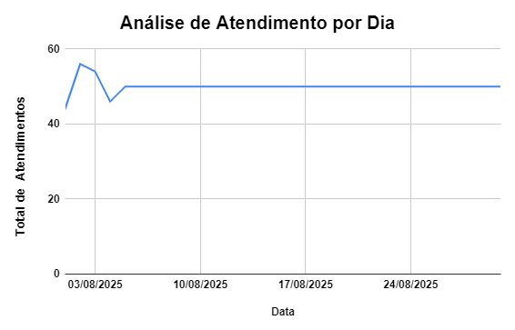

# 📊 Dashboard Interativo – Atendimentos - 30 dias (Google Sheets & Power BI)

Este projeto apresenta um **dashboard interativo no Power BI** para análise de atendimentos de call center nos últimos 30 dias, utilizando uma base de dados em Excel.  

O dashboard permite acompanhar rapidamente os principais **KPIs**, visualizar o **status de chamados** e calcular a **taxa de resolução** automaticamente.

---

## ✨ Funcionalidades

- **Total de atendimentos** por dia e por hora    
- **Status dos atendimentos**: Concluído / Pendente  
- **Taxa de resolução** automática  
- **Gráficos interativos** e KPIs  
- Visualização clara da evolução dos atendimentos  

---

## 🗂 Estrutura do Repositório

│

├─ README.md # Documentação do projeto

├─ Atendimentos_CALL_30dias.xlsx # Base de dados

├─ Dashboard.pbix # Arquivo Power BI

└─ imagens/ # Capturas de tela do dashboard

├─ Analise_de_atendimento.png

├─ Analise_status.png

├─ Analise_Tipoatendimento.png

└─ Performance_por_equipes.png

---

## 🚀 Como usar

1. [Baixar o Power BI Dashboard](Dashboard.pbix)  
2. Abrir no **Power BI Desktop**  
3. Conectar o arquivo `Atendimentos_CALL_30dias.xlsx` como fonte de dados  
4. Navegar pelos gráficos e KPIs para análise completa  

---

## 📷 Visualizações (Exemplos no Power BI)

---

## 📷 Visualizações (Exemplos no Google Sheets)

### Análise de Atendimento

### Análise de Status

### Análise Tipo de Atendimento

### Performance por Equipe

---

## 🛠 Tecnologias Utilizadas

- **Power BI Desktop**  
- **Microsoft Excel** / **Google Sheets**  

---

## 📞 Contato

Desenvolvido por **Victor Hugo Miranda Crispim**  
GitHub: [engvictortech](https://github.com/engvictortech)

