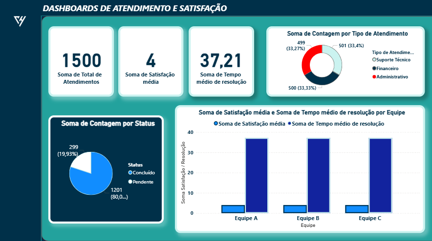

# 📊  Dashboard Interativo – Atendimentos - 30 dias (Google Sheets & Power BI)

Este projeto apresenta um **dashboard interativo no Power BI** para análise de atendimentos de call center nos últimos 30 dias, utilizando uma base de dados em Excel.  

O dashboard permite acompanhar rapidamente os principais **KPIs**, visualizar o **status de chamados** e calcular a **taxa de resolução** automaticamente.

---

## ✨ Funcionalidades

**Total de atendimentos** por dia e por hora    

**Status dos atendimentos**: Concluído / Pendente  

 **Taxa de resolução** automática  

 **Gráficos interativos** e KPIs  

- Visualização clara da evolução dos atendimentos  

---

## 🗂 Estrutura do Repositório

│
├─ README.md # Documentação do projeto 
├─ Atendimentos\_CALL\_30dias.xlsx # Base de dados 
├─ Dashboard.pbix # Arquivo Power BI 
└─ imagens/ # Capturas de tela do dashboard 
├─ Analise\_de\_atendimento.png 
├─ Analise\_status.png 
├─ Analise\_Tipoatendimento.png 
└─ Performance_por_equipes.png

---

## 🚀 Como usar

1\. [Baixar o Power BI Dashboard](powerbi/atendimento-call30dias.pbix)  

2\. Abra no **Power BI Desktop**  

3/. Conecte o arquivo `Atendimentos\_CALL\_30dias.xlsx` como fonte de dados  

4\. Navegue pelos gráficos e KPIs para análise completa  

---

## 📷 Visualizações (Exemplos no Power BI)

## 📷 Visualizações (Exemplos no Google Sheets)

### Análise de Atendimento

### Análise de Status

### Análise Tipo de Atendimento

### Performance por equipe

---

## 🛠 Tecnologias Utilizadas

 **Power BI Desktop**  

**Microsoft Excel** / **Google Sheets**  

---

## 📞 Contato

Desenvolvido por **Victor Hugo Miranda Crispim**  

GitHub: [engvictortech](https://github.com/engvictortech)

